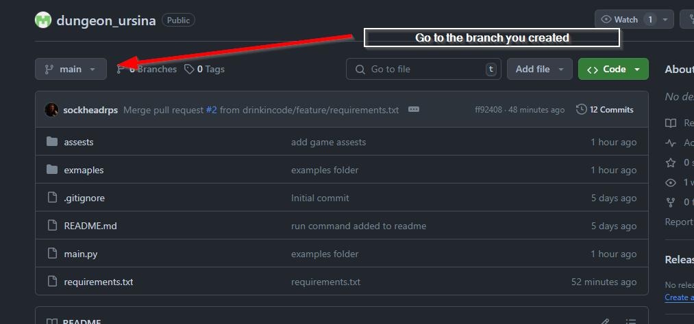
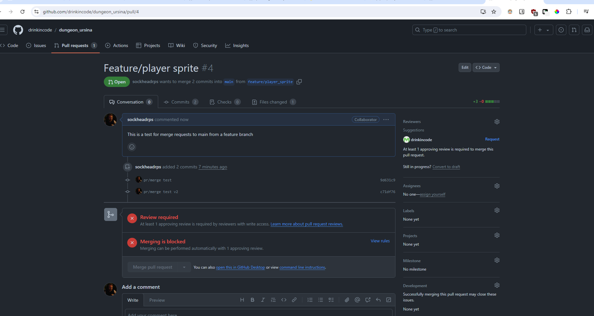

# dungeon

## Dependencies

### Python
Python 3.10 or newer

### Ursina
```
python -m pip install ursina
```
## Test Installation
**Run example game with the following command**
```
python ./ursina_example_game.py
```
## Examples
**Animation**
```
python ./animation_ex.py
```
**Inventory**
```
python ./inventory_ex.py
```
**Custom Assets**
```
python ./custom_assest_ex.py
```

## Contributor Development Workflow
<details>
<summary>Initial Clone, branch and PR</summary>

Clone the repo  
```
git clone https://github.com/drinkincode/dungeon_ursina.git  
```
Make virtual env  
```
python -m venv .venv  
```
Activate venv, update the pip version  (Windows)
```
.venv\Scripts\activate  
python.exe -m pip install --upgrade pip
```
Linux/Macos
```
source .venv/bin/activate
python.exe -m pip install --upgrade pip
```
Install requirements.txt
```
pip install -r requirements.txt
```
Create and checkout a new branch with a descriptive branch name
```
git branch feature/your_descriptive_branchname
git checkout feature/your_descriptive_branchname
```
Add your code, commit and push
```
git add .
git commit -m "your descriptive commit message"
git push
```
Go to the repo on github.com, and to your branch    
https://github.com/drinkincode/dungeon_ursina



Once your code has been reviewed by the repo owner (drinkincode), they will either respond with code reviews requiring changes, or will be merged into main!
</details>

<details>

<summary>Activating virtual envs for later commits and PR's</summary>

### Activation for virtual envs
Navigate to the dir containing the git repo and

Windows
```
.venv\Scripts\activate  
```

MacOS/Linus
```
source .venv/bin/activate
```

Create new branches and request PR's for merges to main as described in the previous instructions

### Deactivating virtual enviornments

Windows, Linux/Macos
```
deactivate
```
</details>
